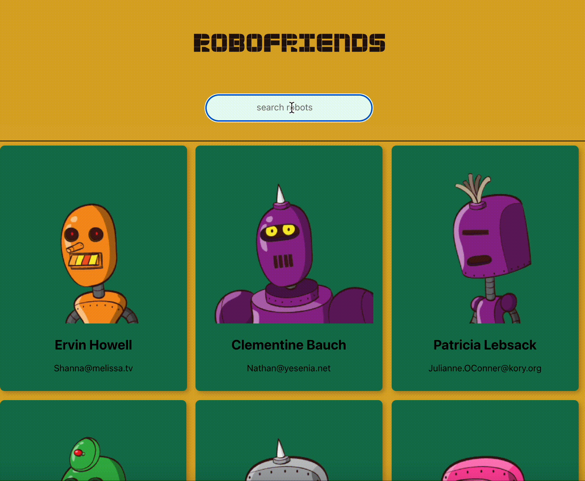

# Robofriends

## Overview
This project aims to allow the users to search and show the possible search input of the available card. It uses state management that reveal changes on status and other information.

## Technology used
- React
- Redux
- Tachyons

## Demo


## Install locally
```
// In the terminal, run the following commands

npm install
npm start

```

## Credits
- [Robohash](https://robohash.org/)

<hr>

### ✨ [Portfolio Preview](https://github.com/RioCantre/rioc-portfolio/blob/main/README.md) 


